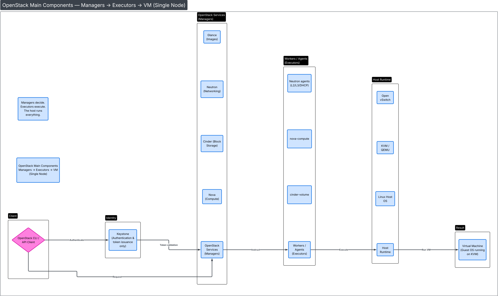

# DevStack – OpenStack Single Node Setup

Minimal setup for running a single-node OpenStack environment using DevStack.

---

## Overview

This repository contains:
- A `local.conf` file for DevStack
- Instructions to deploy OpenStack on Ubuntu 24.04
- A small graph visualizing the [](SetupDiagram.svg)

The setup is intended for **learning, testing, and development** purposes.

---

## System Requirements

- Virtual machine or bare-metal server
- Ubuntu 24.04 (recommended)
- Internet access
- User with `sudo` privileges

---

## Installation

### 1. Clone this repository
```bash
git https://github.com/dreule28/level3-cloud.git
cd level3-cloud

2. Install DevStack
Follow the official DevStack documentation:
https://docs.openstack.org/devstack/latest/

Clone the DevStack repository:
git clone https://opendev.org/openstack/devstack


3. Configuration
Copy the local.conf file from this repository into the DevStack directory:
cp local.conf ~/devstack/


4. Run DevStack
cd ~/devstack
./stack.sh

Result after successful execution:

OpenStack services are running locally

Horizon dashboard is available

OpenStack CLI can be used from the system
