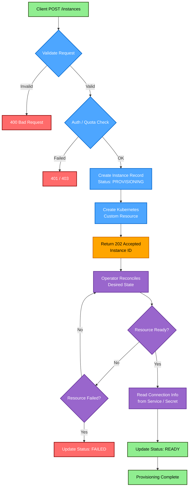

# Week 4+5 – RESTful API & Web UI

---

## Week 4 – Provisioning and Interaction via RESTful API

APIs are the front door to your platform. Make them robust, secure, and developer-friendly.

---

### Overview

Week 4 covers:
- **RESTful API Development**: A production-ready API built with Go and Echo for managing PostgreSQL instances
- **JWT Authentication**: Secure endpoints with HS256 JSON Web Tokens and role-based access control
- **OpenAPI Specification**: Full API documentation in `openapi.yaml`
- **Unit Testing**: Handler and route-level tests using a mock service (no cluster required)
- **Containerization**: Multi-stage Docker build, pushed to STACKIT Container Registry
- **GitOps Deployment**: ArgoCD Application for automated deployment to SKE
- **Auto-Scaling**: HPA configured to scale 1–10 replicas based on CPU and memory
- **Performance Testing**: k6 load tests with a dedicated `/work` CPU-burn endpoint to trigger HPA

---

### Architecture

```
┌─────────────────────────────────────────────────┐
│        External Clients / Web UI                │
└──────────────────┬──────────────────────────────┘
                   │ HTTPS (Ingress + TLS)
┌──────────────────▼──────────────────────────────┐
│           PaaS API  (Echo / Go)                 │
│  POST /auth/login   GET  /auth/me               │
│  GET  /instances    GET  /instances/:id         │
│  POST /instances    DELETE /instances/:id       │
│  GET  /work         GET  /healthz               │
└──────────────────┬──────────────────────────────┘
                   │ Kubernetes Go Client
┌──────────────────▼──────────────────────────────┐
│         PostgreSQL Cluster (CRD)                │
│          (CloudNativePG Operator)               │
└──────────────────┬──────────────────────────────┘
                   │
┌──────────────────▼──────────────────────────────┐
│            STACKIT Kubernetes Engine            │
│              (Managed K8s Cluster)              │
└─────────────────────────────────────────────────┘
```

**Instance Creation Flow:**
```
POST /instances → Validate Input + JWT (admin role)
    → Create CloudNativePG Cluster CR
    → Operator Reconciles → PostgreSQL Deployed
    → Return 202 Accepted with Instance ID
```

---

### Prerequisites

- SKE cluster running (from Week 3) with CloudNativePG Operator installed
- `kubectl` configured for cluster access
- `docker` CLI for building container images
- Go 1.21+ for local development
- k6 for performance testing

---

### API Implementation

#### Project Structure

```
paas-api/
├── cmd/api/main.go              # Entry point (Echo server + CORS + middleware)
├── internal/
│   ├── config/config.go         # Config loaded from env vars
│   ├── http/
│   │   ├── routes.go            # Route registration + JWT middleware wiring
│   │   ├── routes_test.go       # Integration-level route tests (mock service)
│   │   ├── auth/
│   │   │   └── auth.go          # JWT login, RequireJWT & RequireRole middleware
│   │   └── handlers/
│   │       ├── handlers.go      # HTTP handlers (List, Get, Create, Delete)
│   │       └── handlers_test.go # Handler unit tests (mock service)
│   ├── kube/client.go           # Kubernetes Go client setup
│   ├── model/instance.go        # Request/response models
│   └── service/
│       ├── logic.go             # Business logic (CRD management)
│       ├── ports.go             # InstanceAPI interface
│       └── errors.go            # Sentinel errors (ErrNotFound, ErrAlreadyExists)
├── openapi.yaml                 # OpenAPI 3.0 specification
├── go.mod
└── Dockerfile
```

#### API Endpoints

| Method | Endpoint | Auth Required | Description |
|--------|----------|---------------|-------------|
| `GET` | `/healthz` | No | Health check — returns `200 You're amazin` |
| `POST` | `/auth/login` | No | Exchange username/password for a JWT |
| `GET` | `/auth/me` | JWT | Inspect the current token (sub, role, exp) |
| `GET` | `/instances` | JWT | List all PostgreSQL instances |
| `GET` | `/instances/:id` | JWT | Get instance details and connection info |
| `POST` | `/instances` | JWT + admin role | Create a new PostgreSQL instance |
| `DELETE` | `/instances/:id` | JWT + admin role | Delete an instance |
| `GET` | `/work?ms=50` | JWT | CPU-burn endpoint for HPA load testing |

#### Authentication

The API uses **JWT (HS256)** for authentication:

1. `POST /auth/login` — returns `access_token` (Bearer)
2. All `/instances` routes and `/work` require `Authorization: Bearer <token>`
3. `POST` and `DELETE` additionally require the `admin` role claim in the token

```bash
# Get a token
TOKEN=$(curl -s -X POST https://api-daniel-paas.stackit.gg/auth/login \
  -H "Content-Type: application/json" \
  -d '{"username": "admin", "password": "secret"}' \
  | jq -r .access_token)

# Use it
curl -H "Authorization: Bearer $TOKEN" \
  https://api-daniel-paas.stackit.gg/instances
```

#### OpenAPI Specification

The API is documented with OpenAPI 3.0 in [`openapi.yaml`](paas-api/openapi.yaml).

View it by pasting into [editor.swagger.io](https://editor.swagger.io/) or:
```bash
npx @redocly/cli preview-docs paas-api/openapi.yaml
```

---

### Unit Tests

Tests are split into two suites — both use a `fakeSvc` mock that implements the `InstanceAPI` interface, so no real Kubernetes cluster is needed.

| File | What it tests |
|------|---------------|
| `internal/http/handlers/handlers_test.go` | Handler logic: happy paths, error responses, input validation |
| `internal/http/routes_test.go` | Route wiring, JWT middleware, role-based access control |

```bash
cd Week_4+5/paas-api

# Run all tests
go test ./...

# With coverage
go test -cover ./...

# Verbose
go test -v ./internal/http/...
```

---

### Local Development

```bash
cd Week_4+5/paas-api

# Install dependencies
go mod download

# Point kubectl at your SKE cluster
export KUBECONFIG=/path/to/kubeconfig.yml

# Run locally
go run cmd/api/main.go
# Listening on :8080
```

**Quick smoke test:**
```bash
# Health
curl http://localhost:8080/healthz

# Login
TOKEN=$(curl -s -X POST http://localhost:8080/auth/login \
  -H "Content-Type: application/json" \
  -d '{"username":"admin","password":"secret"}' | jq -r .access_token)

# Create an instance
curl -X POST http://localhost:8080/instances \
  -H "Authorization: Bearer $TOKEN" \
  -H "Content-Type: application/json" \
  -d '{"id":"pg-demo","instances":1,"storageGi":10}'

# List instances
curl -H "Authorization: Bearer $TOKEN" http://localhost:8080/instances

# Get details
curl -H "Authorization: Bearer $TOKEN" http://localhost:8080/instances/pg-demo

# Delete
curl -X DELETE -H "Authorization: Bearer $TOKEN" \
  http://localhost:8080/instances/pg-demo
```

---

### Container Image & Deployment

#### Build & Push

```bash
# Build
docker build -t paas-api:latest -f Week_4+5/paas-api/Dockerfile Week_4+5/paas-api/

# Tag for STACKIT Container Registry
docker tag paas-api:latest registry.onstackit.cloud/scr-daniel/paas-api:<tag>

# Push
docker push registry.onstackit.cloud/scr-daniel/paas-api:<tag>
```

#### GitOps Deployment (ArgoCD)

```bash
# Apply ArgoCD Application (automated sync enabled)
kubectl apply -f gitops/argo/app-paas-api.yaml

# Check sync status
argocd app get paas-api

# Manual sync if needed
argocd app sync paas-api
```

ArgoCD auto-syncs on every push to `main` with `prune: true` and `selfHeal: true`.

---

### Bonus Features

#### Automated API Deployment ✓

- ArgoCD Application: [`gitops/argo/app-paas-api.yaml`](../gitops/argo/app-paas-api.yaml)
- Kubernetes manifests: [`gitops/apps/paas-api/`](../gitops/apps/paas-api/) — Deployment, Service, Ingress, HPA, RBAC
- Automated sync triggers on every push to `main`

#### Auto-Scaling and Performance Tests ✓

**HPA** — configured in [`gitops/apps/paas-api/hpa.yaml`](../gitops/apps/paas-api/hpa.yaml):

| Setting | Value |
|---------|-------|
| Min replicas | 1 |
| Max replicas | 10 |
| CPU target | 70% average utilization |
| Memory target | 80% average utilization |
| Scale-up | Immediate — doubles pods every 30 s |
| Scale-down | 5-minute stabilization, max 50% per 60 s |

```bash
# Watch HPA in real time
kubectl get hpa -n paas-api -w

# Detailed metrics
kubectl describe hpa paas-api-hpa -n paas-api
```

**k6 Performance Tests** — [`gitops/apps/paas-api/loadtest/k6.js`](../gitops/apps/paas-api/loadtest/k6.js)

The load test hits `/work?ms=50` to generate CPU load and trigger HPA scaling.

| Stage | Duration | VUs |
|-------|----------|-----|
| Ramp up | 30 s | 0 → 10 |
| Ramp up | 30 s | 10 → 30 |
| Sustained | 60 s | 30 → 60 |
| Ramp down | 30 s | 60 → 0 |

Thresholds: `http_req_failed < 1%`, `p(95) < 2 s`

```bash
kubectl apply -f gitops/apps/paas-api/loadtest/k6-configmap.yaml
kubectl apply -f gitops/apps/paas-api/loadtest/k6-job.yaml

# Follow logs
kubectl logs -n paas-api -l job-name=k6-loadtest -f

# Watch pods scale
kubectl get hpa -n paas-api -w
```

#### Update Functionality

Not implemented.

---

### Understanding the Create Flow



**Flow stages:**
1. **Validation** — Input checked, JWT and admin role verified
2. **Provisioning** — Returns `202 Accepted` immediately, CR created asynchronously
3. **Reconciliation** — CloudNativePG Operator watches and provisions the PostgreSQL cluster
4. **Ready** — Connection info extracted from the Kubernetes Service and Secret

---

---

## Week 5 – Web UI and Secure Public Access

Your platform isn't complete until users can securely access and interact with it.

---

### Overview

Week 5 covers:
- **Vue.js Web UI**: A single-page application for full CRUD management of PostgreSQL instances
- **JWT Integration**: The UI authenticates with the API using the same JWT flow — token stored in `localStorage`, attached to every request via an Axios interceptor
- **Ingress with TLS**: nginx Ingress controller + cert-manager (Let's Encrypt) for HTTPS on public STACKIT subdomains
- **GitOps Deployment**: ArgoCD Application for the UI, same pattern as the API
- **GSAP Animations**: Polished page transitions, KPI count-up animations, and ambient effects

---

### Architecture

```
                Internet
                   │
       ┌───────────▼───────────┐
       │     nginx Ingress     │
       │ (TLS via cert-manager)│
       └──────┬──────┬─────────┘
              │      │
  ┌───────────▼──┐  ┌▼───────────────┐
  │  paas-ui     │  │   paas-api     │
  │  Vue.js SPA  │  │   Go + Echo    │
  │  nginx :80   │  │   :8080        │
  └──────────────┘  └───────┬────────┘
                             │
                  ┌──────────▼──────────┐
                  │  CloudNativePG CRDs │
                  │  (PostgreSQL pods)  │
                  └─────────────────────┘

Public URLs:
  https://daniel-paas.stackit.gg      → Web UI
  https://api-daniel-paas.stackit.gg  → API
```

---

### UI Features

| View | Description |
|------|-------------|
| `/login` | Login form — exchanges credentials for a JWT via `POST /auth/login` |
| `/dashboard` | KPI cards (active / total / failed instances) with GSAP count-up animation |
| `/instances` | Table of all instances with create and delete modals |
| `/instances/:id` | Detail view — status and full connection string |

**Additional details:**
- Vue Router guards redirect unauthenticated users to `/login` and back to the requested route on success
- Pinia stores (`auth.js`, `instances.js`) manage all async state
- Toast notifications for success/error feedback on every action
- Cyberpunk / glassmorphism design: dark theme, neon accents, background grid, cursor glow
- Skeleton loaders while data is fetching

---

### UI Project Structure

```
paas-ui/
├── src/
│   ├── api/
│   │   ├── auth.js        # loginApi / logoutApi / getToken (localStorage)
│   │   ├── axios.js       # Axios instance with auth request interceptor
│   │   └── instances.js   # CRUD calls to /instances
│   ├── stores/
│   │   ├── auth.js        # Pinia auth store (isAuthenticated, login, logout)
│   │   └── instances.js   # Pinia instances store (fetchInstances, addInstance, …)
│   ├── router.js          # Vue Router with beforeEach auth guard
│   ├── views/
│   │   ├── LoginView.vue
│   │   ├── DashboardView.vue
│   │   ├── InstancesView.vue
│   │   └── InstanceDetailView.vue
│   └── components/
│       ├── layout/AppShell.vue   # Sidebar + top bar shell
│       ├── ui/                   # GlassCard, NeonButton, StatusPill, GlassModal, …
│       └── effects/              # BackgroundGrid, CursorGlow
├── Dockerfile             # Multi-stage: Vite build → nginx static serve
├── nginx.conf
└── vite.config.js
```

---

### JWT Flow (UI ↔ API)

```
User enters credentials
        │
        ▼
POST /auth/login ──────────────────────────────► API
                 ◄──── { access_token, expires_in }
        │
        ├─ token stored in localStorage
        │
        ▼
All subsequent API calls include:
  Authorization: Bearer <token>
  (attached automatically by the Axios request interceptor)
        │
        ▼
If 401 received → redirect to /login
```

---

### Ingress & TLS

Configured with `cert-manager` and the `letsencrypt-prod` ClusterIssuer.

| Resource | Namespace | Host | TLS Secret |
|----------|-----------|------|------------|
| API Ingress | `paas-api` | `api-daniel-paas.stackit.gg` | `api-daniel-paas-tls` |
| UI Ingress | `paas-ui` | `daniel-paas.stackit.gg` | `daniel-paas-tls` |

```bash
# Check certificate status
kubectl get certificate -n paas-api
kubectl get certificate -n paas-ui

# Check ingress
kubectl get ingress -n paas-api
kubectl get ingress -n paas-ui
```

---

### Container Image & Deployment

#### Build & Push

```bash
# Build (nginx serves the Vite dist)
docker build -t paas-ui:latest Week_4+5/paas-ui/

# Tag and push
docker tag paas-ui:latest registry.onstackit.cloud/scr-daniel/paas-ui:<tag>
docker push registry.onstackit.cloud/scr-daniel/paas-ui:<tag>
```

#### GitOps Deployment (ArgoCD)

```bash
kubectl apply -f gitops/argo/app-paas-ui.yaml
argocd app sync paas-ui
```

Manifests: [`gitops/apps/paas-ui/`](../gitops/apps/paas-ui/) — Deployment, Service, Ingress, Kustomization.

---

### Bonus Features

#### Automated Deployment of Web UI ✓

- ArgoCD Application: [`gitops/argo/app-paas-ui.yaml`](../gitops/argo/app-paas-ui.yaml)
- Automated sync with `prune: true` and `selfHeal: true`
- Every push to `main` automatically deploys the latest image

#### E2E Tests

Not implemented.

---

## Troubleshooting

### API not starting
```bash
kubectl logs -n paas-api -l app=paas-api
# Common causes: kubeconfig not mounted, RBAC permissions missing
```

### 401 on all requests
```bash
# Verify the JWT secret env var is set in the deployment
kubectl describe deployment paas-api -n paas-api | grep -A5 env
```

### HPA not scaling
```bash
# Metrics server must be running
kubectl top pods -n paas-api
kubectl describe hpa paas-api-hpa -n paas-api
# Ensure resource requests are defined in the Deployment
```

### TLS certificate not issuing
```bash
kubectl describe certificate -n paas-api
kubectl describe certificaterequest -n paas-api
# Check cert-manager logs
kubectl logs -n cert-manager -l app=cert-manager
```

---

## Resources

- [Echo Framework](https://echo.labstack.com/)
- [golang-jwt/jwt](https://github.com/golang-jwt/jwt)
- [OpenAPI Specification](https://swagger.io/specification/)
- [Kubernetes Go Client](https://github.com/kubernetes/client-go)
- [CloudNativePG](https://cloudnative-pg.io/)
- [HPA Documentation](https://kubernetes.io/docs/tasks/run-application/horizontal-pod-autoscale/)
- [k6 Load Testing](https://k6.io/docs/)
- [Vue.js](https://vuejs.org/)
- [Pinia](https://pinia.vuejs.org/)
- [Vite](https://vitejs.dev/)
- [cert-manager](https://cert-manager.io/)
- [ArgoCD](https://argo-cd.readthedocs.io/)
